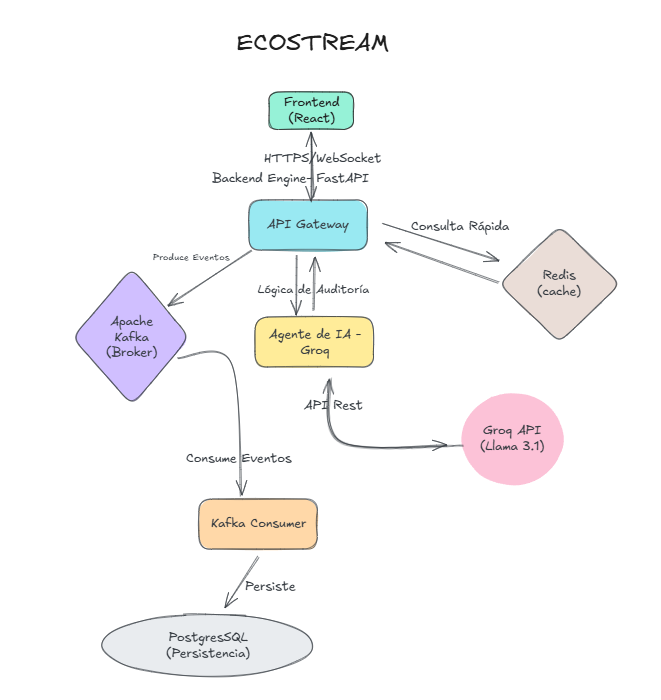
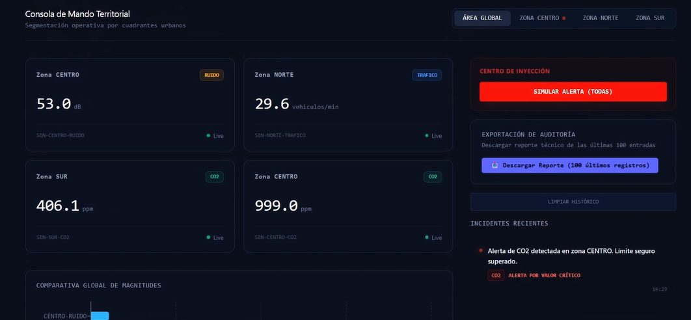

# 🏙️ SmartCity Simulator - IoT Monitoring & AI Auditing Platform

[](https://react.dev/)
[](https://tailwindcss.com/)
[](https://fastapi.tiangolo.com/)
[](https://www.postgresql.org/)
[](https://kafka.apache.org/)
[](https://redis.io/)
[](https://www.docker.com/)
[](https://groq.com/)

> **Estado del Proyecto:** 🟢 Plataforma Operativa y Totalmente Dockerizada.

**SmartCity Simulator** es una plataforma Full-Stack de simulación urbana inteligente que replica el comportamiento de una ciudad conectada mediante sensores IoT virtuales.
La aplicación permite monitorizar en tiempo real múltiples métricas urbanas, procesar eventos distribuidos mediante streaming y generar auditorías inteligentes impulsadas por IA utilizando **Groq + Llama 3.1**.

El ecosistema integra visualización en vivo, análisis automatizado, generación de reportes PDF y procesamiento de eventos a gran escala bajo una arquitectura desacoplada y orientada a microservicios.

---

# 🌐 Características Principales

## 📡 1. Simulación de Sensores IoT en Tiempo Real

Un script emula una infraestructura urbana inteligente capaz de generar y transmitir datos continuamente:

* **Sensores Virtuales Distribuidos:** Simulación de tráfico, contaminación y ruido en ámbitos urbanos.
* **Streaming de Eventos:** Publicación continua de métricas utilizando Apache Kafka como backbone de comunicación distribuida.
* **Actualización en Tiempo Real:** Los datos son consumidos y renderizados instantáneamente en el dashboard mediante comunicación reactiva entre frontend y backend.
* **Persistencia Histórica:** Todos los eventos son almacenados en PostgreSQL para análisis posteriores y trazabilidad completa.

---

## 📊 2. Dashboard de Monitorización Inteligente

El núcleo visual de la aplicación es un panel interactivo diseñado para supervisar el estado global de la ciudad:

* **Visualización Live Metrics:** Gráficas dinámicas y paneles reactivos construidos en React.
* **Estados de Infraestructura:** Seguimiento de anomalías y estados críticos de sensores.
* **KPIs Urbanos:** Métricas agregadas sobre actividad de la ciudad y comportamiento de los dispositivos IoT.
* **Sincronización en Tiempo Real:** El frontend consume eventos emitidos desde FastAPI garantizando actualización continua sin refresco manual.

---

## 🤖 3. Auditoría Inteligente con IA (Groq + Llama 3.1)

La plataforma incorpora un sistema de auditoría automática basado en inteligencia artificial:

* **Análisis Inteligente de Eventos:** Procesamiento de logs y métricas urbanas mediante modelos LLM.
* **Insights Automatizados:** Generación de diagnósticos técnicos y recomendaciones operativas.
* **Integración con Groq API:** Inferencia optimizada utilizando modelos Llama 3.1 de alta velocidad.

---

## 📄 4. Sistema de Reportes PDF

* **Exportación Profesional:** Generación automática de reportes técnicos en formato PDF.
* **Historial de Eventos:** Documentación estructurada de métricas y anomalías detectadas.
* **Formato Empresarial:** Reportes listos para auditoría, supervisión o presentación técnica.

---

# ⚙️ Arquitectura del Sistema

## 🖥️ Frontend (Client Dashboard)

* **Framework:** React + Vite
* **Estilizado:** Tailwind CSS para un diseño responsivo, modular y de alto rendimiento.
* **UI Reactiva:** Renderizado dinámico de métricas y componentes en tiempo real.
* **Gestión de Estado:** Manejo eficiente de flujos de datos para sincronización live.
* **Dashboard Responsive:** Interfaz adaptable para monitorización desde múltiples dispositivos.

---

## 🧠 Backend & Processing Layer

* **Framework Principal:** FastAPI (Python)
* **Arquitectura Asíncrona:** Procesamiento concurrente de eventos IoT.
* **API REST:** Comunicación desacoplada entre servicios y cliente frontend.
* **Sistema de Auditoría IA:** Integración directa con Groq Llama 3.1.

---

## 📦 Streaming & Data Infrastructure

### Apache Kafka

* Broker principal para transmisión de eventos IoT.
* Arquitectura orientada a eventos y desacoplada.
* Procesamiento continuo de datos urbanos.

### Redis

* Cache distribuida para optimización de consultas y métricas en tiempo real.
* Reducción de latencia en dashboards live.

### PostgreSQL

* Persistencia relacional de sensores, eventos y auditorías.
* Almacenamiento histórico y trazabilidad completa.

---

# 🐳 Infraestructura Dockerizada

Toda la plataforma se encuentra completamente containerizada utilizando Docker y Docker Compose:

* **Frontend React Container**
* **Backend FastAPI Container**
* **Apache Kafka Container**
* **Redis Container**
* **PostgreSQL Container**
* **Servicios de Comunicación Integrados**

La arquitectura modular permite desplegar el ecosistema completo con un único comando:

```bash
docker-compose up --build
```

---

# 🚀 Tecnologías Utilizadas

| Tecnología       | Rol dentro del Proyecto   |
| :--------------- | :------------------------ |
| React            | Frontend interactivo      |
| FastAPI          | Backend API REST          |
| PostgreSQL       | Persistencia de datos     |
| Apache Kafka     | Streaming de eventos      |
| Redis            | Cache y optimización      |
| Groq + Llama 3.1 | Auditoría inteligente IA  |
| Docker           | Containerización          |
| Docker Compose   | Orquestación de servicios |

---

## 🏗️ Arquitectura del Sistema
Para entender cómo interactúan los componentes de **EcoStream**, he diseñado el siguiente esquema:

<p align="center">
  
</p>

---

# 🧠 Objetivo del Proyecto

El propósito de **SmartCity Simulator** es demostrar cómo una arquitectura moderna basada en eventos, streaming de datos, inteligencia artificial y sistemas distribuidos puede utilizarse para construir plataformas de monitorización urbana altamente escalables y resilientes.

El proyecto combina conceptos de:

* Internet of Things (IoT)
* Sistemas Distribuidos
* Arquitecturas Event-Driven
* Inteligencia Artificial Aplicada
* Monitorización en Tiempo Real
* Procesamiento Asíncrono
* Infraestructura Cloud-Native

---

# 📌 Futuras Mejoras

* Integración con WebSockets para streaming ultra low-latency.
* Sistema de alertas inteligentes en tiempo real.
* Predicción de anomalías mediante modelos ML.
* Panel administrativo avanzado.
* Simulación de múltiples ciudades simultáneas.
* Autenticación JWT y control RBAC.
* Integración con Kubernetes para despliegue cloud.

---
## 🎥 Demo del Proyecto
¡Haz clic en la imagen para ver cómo funciona el motor de EcoStream en tiempo real!
](https://youtu.be/4_OAYPGkOo0)
<p align="center">
  
</p>

*En este video de 3 minutos verás el flujo completo: desde la inyección de telemetría hasta el análisis cognitivo realizado por el agente de IA.*

# 👨‍💻 Autor

Desarrollado como proyecto Full-Stack orientado a simulación IoT, procesamiento distribuido y auditoría inteligente con IA por HwangVi.
